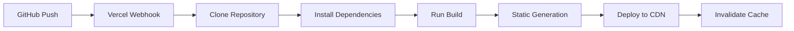
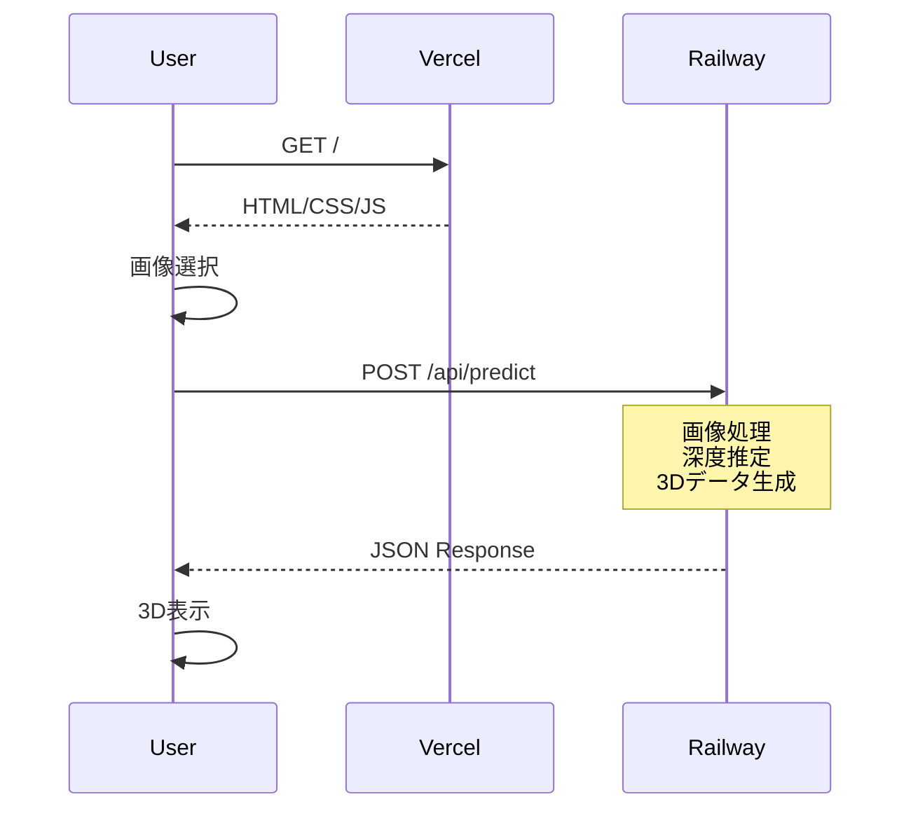

# デプロイメントアーキテクチャ詳細

## システム全体構成

```
┌─────────────────────────────────────────────────────────────────┐
│                          インターネット                            │
└─────────────────┬───────────────────────┬──────────────────────┘
                  │                       │
                  │                       │
┌─────────────────▼──────────┐  ┌────────▼────────────────────┐
│         Vercel CDN         │  │      Railway Platform        │
│   Global Edge Network      │  │   Asia-Southeast (SG)        │
│                           │  │                              │
│  ┌─────────────────────┐  │  │  ┌────────────────────────┐  │
│  │   Next.js App       │  │  │  │   FastAPI Server       │  │
│  │                     │  │  │  │                        │  │
│  │  - Pages           │  │  │  │  - Uvicorn ASGI       │  │
│  │  - Components      │  │  │  │  - 1 Replica          │  │
│  │  - Static Assets   │  │  │  │  - Auto-scaling OFF   │  │
│  │                     │  │  │  │                        │  │
│  └─────────────────────┘  │  │  └────────────────────────┘  │
│                           │  │                              │
└───────────────────────────┘  └──────────────────────────────┘
```

## Vercel デプロイメント詳細

### ビルドプロセス



### ビルド設定

```yaml
Framework Preset: Next.js
Node.js Version: 18.x
Build Command: npm run build
Output Directory: .next
Install Command: npm install
Development Command: npm run dev

Environment Variables:
  NEXT_PUBLIC_BACKEND_URL: https://web-production-a0df.up.railway.app
```

### ファイル構造（ビルド後）

```
.next/
├── cache/
│   └── webpack/
├── server/
│   ├── pages/
│   │   ├── _app.js
│   │   ├── _document.js
│   │   └── index.js
│   └── chunks/
├── static/
│   ├── chunks/
│   │   ├── framework-*.js (44.8KB)
│   │   ├── main-*.js (38.6KB)
│   │   └── pages/
│   └── css/
│       └── *.css
└── BUILD_ID
```

### CDN 配信戦略

```typescript
// next.config.js での最適化設定
module.exports = {
  images: {
    domains: ['web-production-a0df.up.railway.app'],
  },
  compress: true,
  poweredByHeader: false,
  reactStrictMode: true,
  swcMinify: true,
}
```

### Edge Functions 設定

```typescript
// Vercel Edge Config
export const config = {
  runtime: 'edge',
  regions: ['sin1', 'hnd1', 'iad1'], // Singapore, Tokyo, US East
}
```

## Railway デプロイメント詳細

### Nixpacks ビルドプロセス

```dockerfile
# Railway が自動生成する Dockerfile 相当
# Phase 1: 依存関係の検出
DETECT Python project
FOUND requirements.txt

# Phase 2: ベースイメージ選択
FROM python:3.11-slim

# Phase 3: システム依存関係
RUN apt-get update && apt-get install -y \
    gcc \
    libjpeg-dev \
    zlib1g-dev

# Phase 4: Python依存関係
COPY requirements.txt .
RUN pip install --no-cache-dir -r requirements.txt

# Phase 5: アプリケーションコピー
COPY . /app
WORKDIR /app

# Phase 6: 起動コマンド
CMD ["uvicorn", "app:app", "--host", "0.0.0.0", "--port", "$PORT"]
```

### リソース割り当て

```yaml
Service: web
Resources:
  CPU: 1 vCPU (shared)
  Memory: 512MB
  Disk: 1GB (ephemeral)

Scaling:
  Replicas: 1
  Auto-scaling: Disabled
  
Network:
  Public Domain: web-production-a0df.up.railway.app
  Private Network: web.railway.internal
  Port: Dynamic ($PORT)
```

### 環境変数管理

```bash
# Railway 自動設定
PORT=<dynamic>
RAILWAY_ENVIRONMENT=production
RAILWAY_REPLICA_ID=<uuid>
RAILWAY_DEPLOYMENT_ID=<uuid>

# カスタム設定
PYTHON_VERSION=3.11
PYTHONUNBUFFERED=1
```

## ネットワークアーキテクチャ

### リクエストフロー

```
1. ユーザー → Cloudflare DNS
2. DNS → Vercel Edge Network
3. Vercel → Static Assets (CDN)
4. Browser → Railway API (Direct)
```

### CORS 設定

```python
# Railway Backend
app.add_middleware(
    CORSMiddleware,
    allow_origins=["*"],  # Production では制限すべき
    allow_credentials=True,
    allow_methods=["*"],
    allow_headers=["*"],
)
```

### API通信フロー



## セキュリティ設定

### Vercel セキュリティヘッダー

```javascript
// next.config.js
async headers() {
  return [
    {
      source: '/:path*',
      headers: [
        {
          key: 'X-Frame-Options',
          value: 'DENY',
        },
        {
          key: 'X-Content-Type-Options',
          value: 'nosniff',
        },
        {
          key: 'X-XSS-Protection',
          value: '1; mode=block',
        },
      ],
    },
  ]
}
```

### Railway セキュリティ

```python
# レート制限
from slowapi import Limiter
limiter = Limiter(key_func=lambda: "global", default_limits=["100/hour"])

# ファイルサイズ制限
MAX_FILE_SIZE = 10 * 1024 * 1024  # 10MB

# Content-Type検証
ALLOWED_TYPES = ['image/jpeg', 'image/png', 'image/webp']
```

## モニタリングとログ

### Vercel Analytics

```typescript
// pages/_app.tsx
import { Analytics } from '@vercel/analytics/react'

export default function App({ Component, pageProps }) {
  return (
    <>
      <Component {...pageProps} />
      <Analytics />
    </>
  )
}
```

### Railway Logs

```python
# 構造化ログ
import logging
import json

class JSONFormatter(logging.Formatter):
    def format(self, record):
        return json.dumps({
            'timestamp': record.created,
            'level': record.levelname,
            'message': record.getMessage(),
            'path': record.pathname,
            'line': record.lineno
        })

logger = logging.getLogger(__name__)
handler = logging.StreamHandler()
handler.setFormatter(JSONFormatter())
logger.addHandler(handler)
```

## CI/CD パイプライン

### GitHub Actions 統合

```yaml
name: Deploy
on:
  push:
    branches: [master]

jobs:
  deploy:
    runs-on: ubuntu-latest
    steps:
      - uses: actions/checkout@v3
      
      # Vercel は自動デプロイ
      # Railway も自動デプロイ
      
      # オプション: テスト実行
      - name: Run Tests
        run: |
          cd frontend && npm test
          cd ../railway-backend && python -m pytest
```

## 災害復旧計画

### バックアップ戦略

```bash
# 1. コードベース: GitHub
# 2. 環境変数: ローカルバックアップ
# 3. デプロイ設定: railway.json, vercel.json

# 復旧手順
1. GitHub からクローン
2. 環境変数再設定
3. 再デプロイ実行
```

### フェイルオーバー

```typescript
// フロントエンド側のフォールバック
const BACKEND_URLS = [
  process.env.NEXT_PUBLIC_BACKEND_URL,
  'https://backup-api.example.com',  // バックアップAPI
]

async function callAPI(endpoint, options) {
  for (const baseURL of BACKEND_URLS) {
    try {
      const response = await fetch(`${baseURL}${endpoint}`, options)
      if (response.ok) return response
    } catch (error) {
      continue
    }
  }
  throw new Error('All backends failed')
}
```

## パフォーマンス最適化

### Vercel 最適化

```javascript
// 画像最適化
import Image from 'next/image'

// 動的インポート
const HeavyComponent = dynamic(() => import('./HeavyComponent'), {
  loading: () => <Spinner />,
  ssr: false,
})

// API Routes キャッシュ
export const revalidate = 3600 // 1時間
```

### Railway 最適化

```python
# コネクションプーリング
from concurrent.futures import ThreadPoolExecutor
executor = ThreadPoolExecutor(max_workers=4)

# メモリ効率的な画像処理
def process_image_stream(file_stream):
    # チャンクごとに処理
    for chunk in iter(lambda: file_stream.read(4096), b''):
        process_chunk(chunk)
```

## コスト構造

### 月額費用内訳

| サービス | プラン | 使用量 | 費用 |
|---------|--------|--------|------|
| Vercel | Hobby | 100GB帯域 | $0 |
| Railway | Starter | 500MB RAM | $5 |
| GitHub | Free | Public Repo | $0 |
| **合計** | | | **$5** |

### スケーリング時のコスト予測

```
月間10万リクエストの場合:
- Vercel: $0 (Hobbyプラン内)
- Railway: $5-10 (CPU使用量による)
- 帯域幅: 約50GB = $0

月間100万リクエストの場合:
- Vercel Pro: $20
- Railway Pro: $20
- 帯域幅: 約500GB = $45
- 合計: $85/月
```

## 将来の拡張計画

### マルチリージョン展開

```yaml
Regions:
  Primary: Singapore (sin1)
  Secondary: 
    - Tokyo (hnd1)
    - US East (iad1)
    - EU West (fra1)
    
Load Balancing:
  Type: GeoDNS
  Health Check: /health
  Failover: Automatic
```

### マイクロサービス化

```
┌─────────────┐     ┌─────────────┐     ┌─────────────┐
│   Gateway   │────▶│ Depth API   │     │  3D API     │
│   (Kong)    │     │  (FastAPI)  │     │  (FastAPI)  │
└─────────────┘     └─────────────┘     └─────────────┘
                            │                    │
                    ┌───────┴────────┐  ┌───────┴────────┐
                    │  Queue (Redis) │  │   Storage      │
                    │                │  │   (S3/R2)      │
                    └────────────────┘  └────────────────┘
```