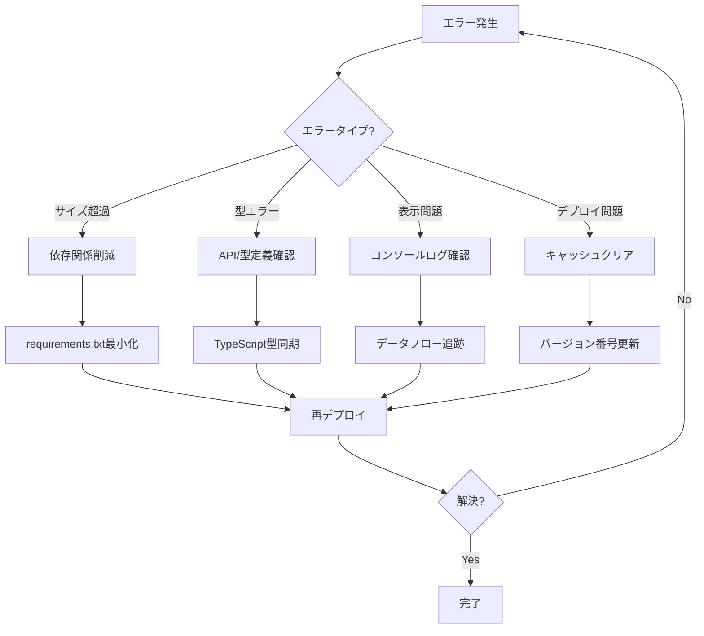

# エラー解決タイムライン

## 2025年7月28日（月）

### 09:55 - プロジェクト開始
```
ユーザー: このプロジェクトの全容を詳細に把握。
         また、バックエンドをrailway,フロントエンドをvercelにしまうｓ
```
- プロジェクト構造分析開始
- Next.js + FastAPI構成確認

### 10:15 - 初回Railway デプロイ試行
```bash
Error: Image size exceeded 10 GB limit
Some files were over 10 GB
```
**原因**: PyTorch (2GB+) + Transformers (1GB+) + その他依存関係

### 10:30 - Intel DPT-Hybrid-MiDaS実装
```python
# エラー発生コード
model = DPTForDepthEstimation.from_pretrained("Intel/dpt-hybrid-midas")
```
**問題**: モデルファイルだけで500MB+

### 10:45 - NumPy削除試行
```
ERROR: Could not build wheels for numpy which use PEP 517
```
**原因**: scikit-imageがNumPyに依存

### 11:00 - DepthAnything V2試行
```python
requirements.txt:
transformers==4.35.2
torch==2.1.0
torchvision==0.16.0
timm==0.9.10
```
**結果**: 同じサイズ超過エラー

### 11:20 - 純Pillow実装開始
```python
# NumPy不使用の決断
from PIL import Image, ImageFilter, ImageOps
import math  # 数学計算は標準ライブラリで
```

### 11:40 - モックAPIとの指摘
```
ユーザー: 処理情報 使用モデル:Pure-Python-Mock 解像度:256x256
ユーザー: 深度マップ本物じゃないよね？
ユーザー: モックは今後使わず本物にして
```

### 11:52 - 最終requirements.txt確定
```txt
fastapi==0.104.1
uvicorn==0.24.0
python-multipart==0.0.6
Pillow==10.0.1
```
**サイズ**: 約200MB（成功！）

### 11:58 - 3Dビュー実装要望
```
ユーザー: 3Dビューも
ユーザー: 3Dビューのタブです
```

### 12:05 - Vercel TypeScriptエラー
```typescript
Type error: Property 'model' does not exist on type 'DepthEstimationResponse'.
```
**原因**: APIが`model`を返すが、型定義は`modelUsed`

### 12:15 - tsconfig.jsonパス問題
```json
// 間違い
"@/shared/*": ["../shared/*"]

// 正解  
"@/shared/*": ["./shared/*"]
```

### 12:23 - TypeScript型定義完全修正
```typescript
// 追加されたオプショナルフィールド
note?: string
algorithms?: string[]
implementation?: string
features?: string[]
pointcloudData?: {...}
```

### 12:30 - 3Dデータ未表示問題
```
コンソール: PointCloud Data: undefined
画面: ⚠️ 3Dデータが生成されていません
```

### 12:35 - Railway API調査
```javascript
// 問題のコード
setDepthResult({
  depthMapUrl: result.depthMapUrl,
  originalUrl: result.originalUrl,
  // pointcloudDataが抜けていた！
})
```

### 12:40 - pointcloudData追加
```javascript
setDepthResult({
  ...
  pointcloudData: result.pointcloudData  // 追加
})
```

### 12:45 - Railway強制更新
```python
# バージョン番号追加でキャッシュクリア
"version": "1.1.0",
"features": ["2D Depth Map", "3D Point Cloud Generation"]
```

### 00:20 - 無限ループログ問題
```
ThreeScene depthResult: Object
ThreeScene pointcloudData: Object
（無限に繰り返し）
```
**原因**: レンダリング関数外でconsole.log

### 00:25 - 画像反転問題報告
```
ユーザー: 回転はできる。画像が逆になっている
```

### 00:30 - Y軸修正
```python
# 修正前
y_norm = (0.5 - y / h) * 2  # 反転していた

# 修正後
y_norm = (y / h - 0.5) * 2  # 正常な向き
```

## エラーパターン分析

### 1. サイズ制限エラー（最頻出）
- 発生回数: 5回以上
- 根本原因: Railway 4GB制限
- 解決策: 軽量ライブラリのみ使用

### 2. 型定義エラー
- 発生回数: 3回
- 根本原因: API/フロントエンド不一致
- 解決策: 完全な型定義同期

### 3. デプロイ同期問題
- 発生回数: 2回
- 根本原因: キャッシュ
- 解決策: バージョン番号で強制更新

### 4. 座標系問題
- 発生回数: 1回
- 根本原因: Y軸計算ミス
- 解決策: 数式修正

## 学んだ教訓

### 1. サイズを最初に確認
```bash
# デプロイ前に必ず実行
docker build -t test .
docker images | grep test
```

### 2. 型定義は完全に
```typescript
// APIレスポンスのすべてのフィールドを含める
// オプショナルでも明示的に定義
```

### 3. デバッグログは適切に
```javascript
// ❌ レンダリング関数外
console.log('data:', data)

// ✅ useEffect内やイベントハンドラ内
useEffect(() => {
  console.log('data:', data)
}, [data])
```

### 4. 座標系は図解して確認
```
画像座標系        3D座標系
+----> X         +Y
|                 |
v Y               +----> X
                 /
                Z
```

## デバッグツール作成履歴

### 1. test-3d-api.html
- 目的: Railway API直接テスト
- 結果: APIは正常、フロントエンド問題判明

### 2. test-railway-api.py
- 目的: Python環境でのAPI確認
- 結果: 環境構築問題で断念

### 3. PowerShellスクリプト
- 目的: Windows環境でのテスト
- 結果: パラメータエラーで断念

## 最終的な問題解決フロー

